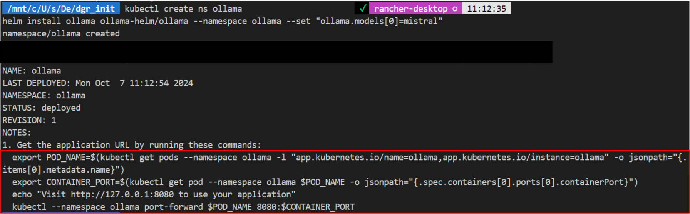
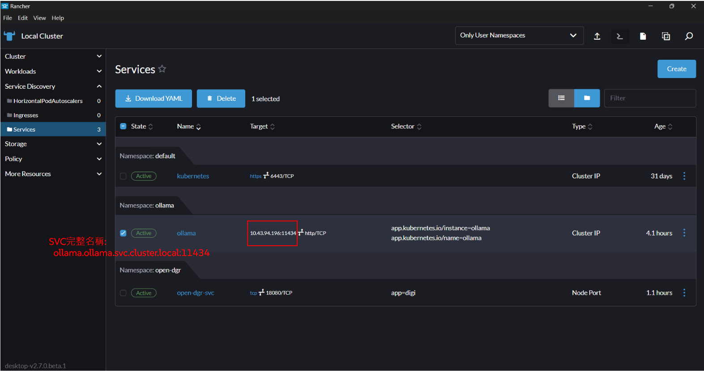
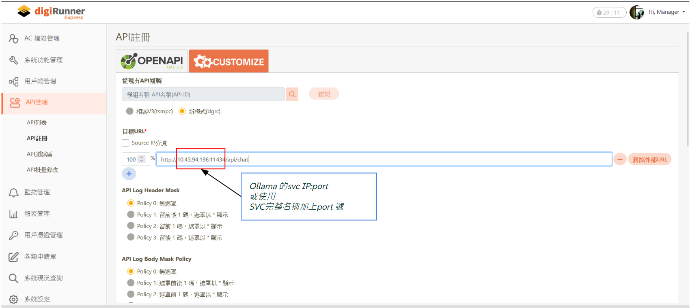
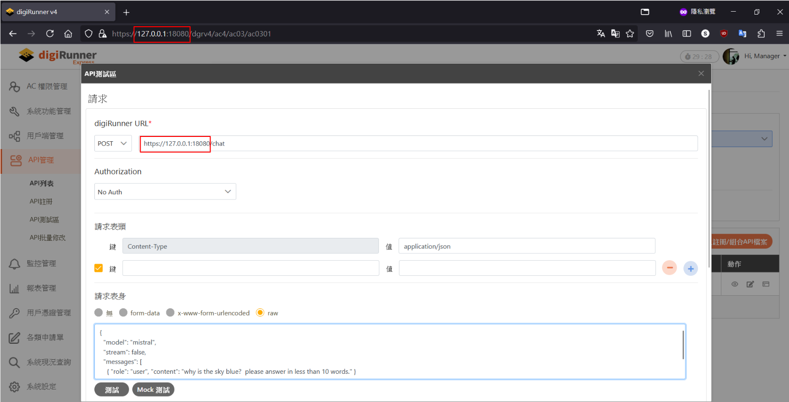
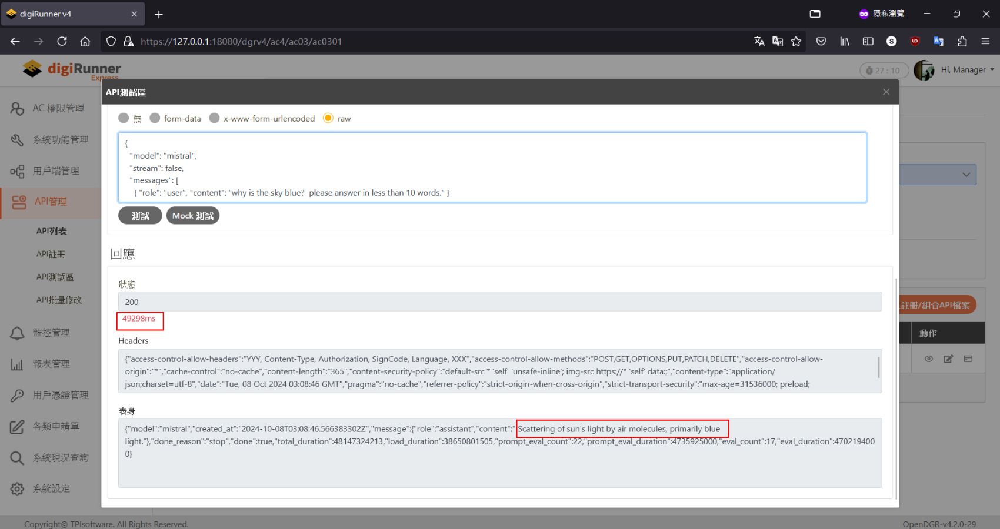

# ollama-with-dgR
---

# 下載 Rancher desktop
https://rancherdesktop.io/

---
# Part1.
### macOS optional:
 - 安裝 helm
```
brew install helm
```
### ollama helm chart
https://github.com/otwld/ollama-helm.git
 - Repo 中包含了安裝的資訊、values 等...資訊
 - Ollama：通用型大模型框架
 - Mistral：是一個大型語言模型
```
git clone https://github.com/otwld/ollama-helm.git
```
```
helm repo add ollama-helm https://otwld.github.io/ollama-helm/
helm repo update
```
```
kubectl create ns ollama
helm install ollama ollama-helm/ollama --namespace ollama --set "ollama.models[0]=mistral"
```

### 確認 ollama 成功運行:
```
export POD_NAME=$(kubectl get pods --namespace ollama -l "app.kubernetes.io/name=ollama,app.kubernetes.io/instance=ollama" -o jsonpath="{.items[0].metadata.name}")
export CONTAINER_PORT=$(kubectl get pod --namespace ollama $POD_NAME -o jsonpath="{.spec.containers[0].ports[0].containerPort}")
echo "Visit http://127.0.0.1:8080 to use your application"
kubectl --namespace ollama port-forward $POD_NAME 8080:$CONTAINER_PORT
```

http://localhost:8080

---
# Part2.
### 安裝 OpenDGR:
 - OpenDGR 是一個 API gateway 和管理解決方案，可作為客戶端應用程式和後端服務之間的中介
 - 直接透過 cURL 指令抓取 yaml 並安裝到 rancher
 - 這個 yaml 內的資源包含 namespace, deployment, svc，可以運行到任何 k8s 架構裡
```
curl -s https://raw.githubusercontent.com/TPIsoftwareOSPO/digiRunner_Open/refs/heads/master/manifest/open_dgr.yaml | kubectl apply -f -
```

### 使用 kubectl port-forward 功能
 - 登入 OpenDGR 
```
export POD_NAME=$(kubectl get pods --namespace open-dgr -o jsonpath="{.items[0].metadata.name}")
export CONTAINER_PORT=$(kubectl get pod --namespace open-dgr $POD_NAME -o jsonpath="{.spec.containers[0].ports[0].containerPort}")

echo "Visit OpenDGR:\nhttp://127.0.0.1:18080/dgrv4/ac4/login"
kubectl --namespace open-dgr port-forward $POD_NAME 18080:$CONTAINER_PORT
```
http://127.0.0.1:18080/dgrv4/ac4/login

 - 預設帳號、密碼:
```
manager
manager123
```

### 使用 digiRunner 註冊 API
 - 將 ollama 的API 透過 digiRunner 導向
 - 找到 ollama 的 SVC_IP:PORT，進行 API 設定

---

### 情境1 (內部 Cluster API )
```
# 使用 SVC:PORT 存取服務，格式如:
http://<SVC_IP>:<PORT>

# 或使用 Service 的完整名稱 來進行呼叫，格式如:
http://<service-name>.<namespace>.svc.cluster.local

# 範例:
http://ollama.ollama.svc.cluster.local:11434/api/chat
```
 - 於 rancher 上找到 SVC 資訊 (IP:port)
 - 或使用 k8s 的內部完整名稱

 - 註冊 API

 - 呼叫 API

 - 查看結果

### 情境2 (外部 API )
 - 註冊 cluster 外部 API，將 openDGR 當作 proxy 使用
```
https://httpbin.org/ip
```

---

### Ollama API 格式:
#### 參照 ollama github 說明
https://github.com/ollama/ollama/blob/main/docs/api.md#generate-a-completion
```
curl http://<SVC_IP>:<PORT>/api/chat -d '
{
  "model": "mistral",
  "stream": false,
  "messages": [
    { "role": "user", "content": "why is the sky blue?  please answer in less than 10 words." }
  ]
}
'
```
https://github.com/ollama/ollama/blob/main/docs/api.md#generate-a-chat-completion
```
# 範例2
curl http://<SVC_IP>:<PORT>/api/generate -d '
{
  "model": "mistral",
  "prompt": "Why is the sky blue? please answer in less than 10 words.",
  "stream": false
}
'
```
